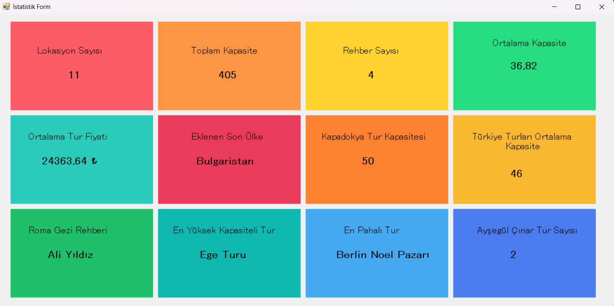

# 💻 C# EĞİTİM KAMPI PROJELERİ

Bu repo, Murat Yücedağ'ın eğitmenliğinde tamamladığım C# Eğitim Kampı süresince geliştirdiğim ilk 10 projeyi içermektedir. Her bir proje, programlama becerilerimi pekiştirmek ve C# dilinin temel yapı taşlarını öğrenmek için hazırlanmıştır. Projelerin detayları aşağıda açıklanmıştır:

## ✅ Proje 1: Merhaba Dünya!
Bu ilk projede, konsol uygulamaları yazmaya başlangıç yaptım. Console.WriteLine() komutu ile konsola yazdırmayı öğrendim ve bir C# uygulamasının temel yapısını keşfettim. 

## ✅ Proje 2: Değişkenler ve Veri Türleri
Bu projede, int, string, double gibi temel veri türlerinde değişkenler tanımladım. Değişkenler üzerinde matematiksel ve metinsel işlemleri deneyerek veri tiplerinin ne işe yaradıklarını öğrendim. 

## ✅ Proje 3: Karar Yapıları (If-Else)
Bu projede, karar mekanizmaları kullanarak farklı senaryolara uygun çözümler geliştirdim. if, else if, else yapıları ve switch-case kullanarak, girdilere göre programın nasıl davrandığını simüle ettim. 

## ✅ Proje 4: Döngüler (Loops)
Tekrarlayan işlemleri otomatikleştirmek amacıyla for, while ve foreach döngüleriyle çalıştım. Farklı döngü türlerinin kullanımları üzerine testler yaparak döngülerle daha etkili kod yazmayı öğrendim. 

## ✅ Proje 5: Döngüler İle Şekil Oluşturma (Loops With Stars)
Bu projede, döngü yapıları kullanarak konsola farklı şekiller çizmeyi öğrendim. Yıldız (*) karakterini kullanarak üçgen, ters üçgen gibi geometrik şekiller oluşturmayı başardım.

## ✅ Proje 6: Diziler (Arrays)
Diziler projeme birden çok veri ile çalışma üzerine odaklandım. Eleman eklemeyi, güncellemeyi ve for veya foreach döngüleriyle diziler üzerinde işlem yapmayı denedim. 

## ✅ Proje 7: Sınav Değerlendirme Sistemi ve Foreach Döngüsü
Bu projede, öğrencilerin sınav notlarını alarak ortalama ve geçme durumlarını hesaplayan bir sınav sistemi yazdım. Özellikle foreach döngüsünü kullanarak öğrenci verilerinin daha efektif bir şekilde işlenebileceğini keşfettim. 

## ✅ Proje 8: Metotlar (Methods)
Kod tekrarını azaltmak ve fonksiyonel programlama becerileri kazanmak adına bu projede metotlar üzerinde çalıştım. Parametre alan, sonuç döndüren, hatta farklı senaryolara özel işlemler yapan metotlar oluşturdum. 

## ✅ Proje 9: Veritabanı Bağlantısı ile Ürün ve Kategori Bilgi Sistemi
Bu projede, SqlConnection ve SqlCommand sınıflarını kullanarak bir veritabanına bağlanmayı ve SQL sorguları çalıştırmayı öğrendim. Ürün ve kategori bilgilerini kullanıcı seçimine göre ekrana listeleyen bir uygulama geliştirdim. 

## ✅ Proje 10: Menü Sipariş Yönetim Paneli
Bu projede, veritabanına bağlı CRUD (Create, Read, Update, Delete) işlemleri gerçekleştiren bir sistem geliştirdim. Sipariş yönetim ekranı oluşturarak kullanıcıların ürün ekleme, güncelleme ve silme işlemlerini kolayca gerçekleştirebilmesini sağladım. 

## ✅ Proje 11: EfTravel İstatistik Paneli

Bu projede, Entity Framework kullanarak bir seyahat veri tabanına bağlanıp, bu bilgileri analiz ederek bir istatistik paneli geliştirdim. Proje, Windows Forms tabanlı bir arayüzde, kullanıcıya anlık istatistiksel bilgiler sunmayı hedefledi. 

Proje Özellikleri:
+ Toplam lokasyon, kapasite ve rehber sayısı gibi genel verilerin hesaplanması.
+ Ortalama kapasite ve fiyat gibi istatistiki değerlerin görüntülenmesi.
+ Belirli bir şehir veya ülkeye özel verilerin filtrelenmesi.
+ En yüksek kapasiteye ve fiyata sahip şehirlerin belirlenmesi.
+ Rehber bazlı tur sayılarının hesaplanması.

Bu Projeden Kazandıklarım:
+ Entity Framework ile veri tabanına bağlanma, veri sorgulama ve LINQ kullanarak filtreleme işlemlerini geliştirdim.
+ Windows Forms ile veri tabanındaki bilgileri görselleştirerek kullanımı kolay bir arayüz tasarladım.
+ Elde edilen verileri işleyerek projeye işlevsellik kazandırdım ve sunulan bilgileri daha etkili hale getirdim. 

Bu çalışma sayesinde hem veri tabanı yönetimi hem de görselleştirme konularında önemli deneyimler kazandım. Ayrıca, C# dilindeki temel kavramları pratikte uygulama imkanı bularak bilgimi pekiştirdim. Gelecek projelerde, bu temelin üzerine yeni yetkinlikler eklemeyi hedefliyorum!
